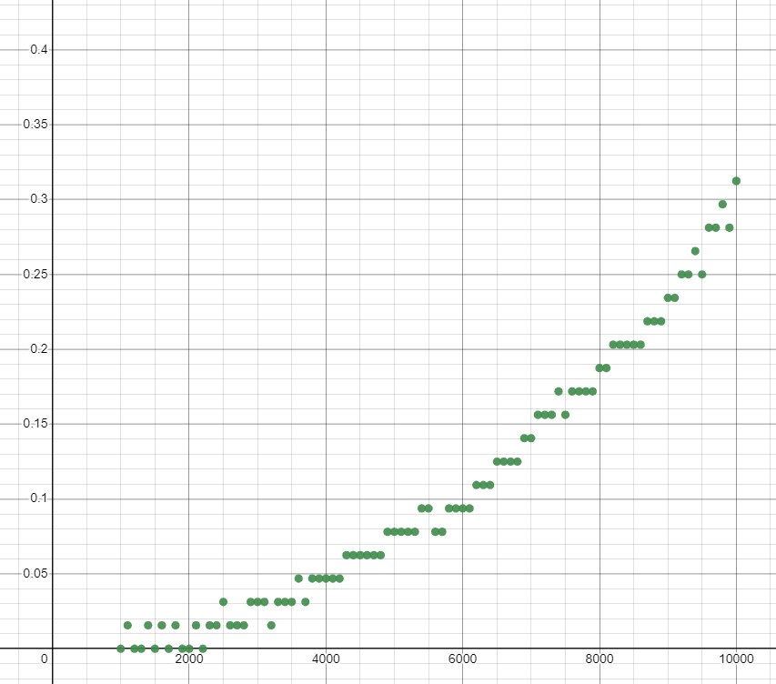
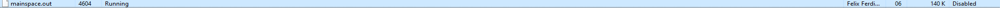
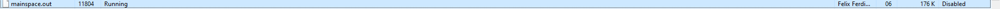
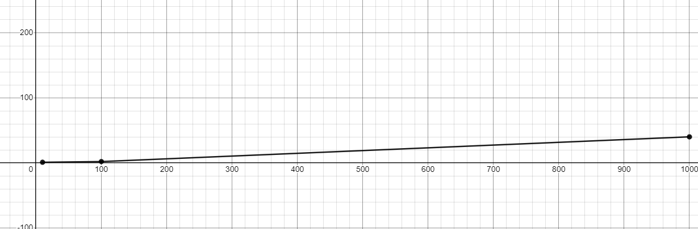

# matrix-vector-mult-benchmark

In this repository, I will provide results regarding the implementations of matrix multiplication, vector multiplication and also matrix vector multiplication.

# Run

In order to run the program for main_test.c, you will need to do the following.command

```
make
```

After make has been typed, type the next command

```
./main.out
```

the results would be as followed (In this case, the value of the matrix inside is being generated randomly from the value 0 to 15)

```
Matrix = [
7,      6,      9,       
3,      1,      15,      
10,     12,     9,      ]
Vector =[
13,
10,
11,     ]
Matrix Vector = [        
250,
214,
349,    ]
```

# Time Complexity and Space Complexity Benchmark

## Time Complexity

After running the code below, it will describe the amount of time it takes for a computer to run this specific algorithm


In your terminal you will need to type the command below

```
make
```

after make has been typed, type the next command below;

```
./maketesttime.out
```

I have stored the data of my time complexity using a .dat file which turns the result into a format which is usable to be implmented into a graph. After ./maketesttime.out is done, follow the command below

```
./time.dat
```
the command above will return the results into a format suitable for a graph implementation.

```
(1000,0.000000),(1100,0.000000),(1200,0.000000),(1300,0.015625),(1400,0.015625),(1500,0.015625),(1600,0.000000),(1700,0.000000),(1800,0.000000),(1900,0.015625),(2000,0.015625),(2100,0.015625),(2200,0.015625),(2300,0.015625),(2400,0.015625),(2500,0.015625),(2600,0.015625),(2700,0.031250),(2800,0.015625),(2900,0.031250),(3000,0.031250),(3100,0.015625),(3200,0.031250),(3300,0.031250),(3400,0.031250),(3500,0.031250),(3600,0.046875),(3700,0.031250),(3800,0.046875),(3900,0.046875),(4000,0.046875),(4100,0.046875),(4200,0.046875),(4300,0.046875),(4400,0.046875),(4500,0.046875),(4600,0.062500),(4700,0.062500),(4800,0.062500),(4900,0.078125),(5000,0.062500),(5100,0.078125),(5200,0.078125),(5300,0.093750),(5400,0.093750),(5500,0.093750),(5600,0.093750),(5700,0.093750),(5800,0.093750),(5900,0.093750),(6000,0.109375),(6100,0.109375),(6200,0.109375),(6300,0.109375),(6400,0.109375),(6500,0.125000),(6600,0.125000),(6700,0.140625),(6800,0.140625),(6900,0.140625),(7000,0.125000),(7100,0.140625),(7200,0.140625),(7300,0.156250),(7400,0.156250),(7500,0.156250),(7600,0.171875),(7700,0.156250),(7800,0.171875),(7900,0.171875),(8000,0.187500),(8100,0.171875),(8200,0.187500),(8300,0.218750),(8400,0.203125),(8500,0.203125),(8600,0.203125),(8700,0.218750),(8800,0.218750),(8900,0.218750),(9000,0.234375),(9100,0.250000),(9200,0.234375),(9300,0.250000),(9400,0.250000),(9500,0.265625),(9600,0.265625),(9700,0.265625),(9800,0.281250),(9900,0.281250),(10000,0.281250)

where x is the matrix size and y is the time elapsed!
```


The result where n starts from 1000 to 10000.


## Space Complexity

In order for you to be able to run the space complexity, use the command below:

```
make
````

```
./mainspace.out
```

After the code has been run for specific matrix sizes, the memory usage can be checked via the task the manager.

here are my results:






After gathering the data, we can conclude a graph where the matrix sizes are in the y-axis and the memory usage are in the x-axis




